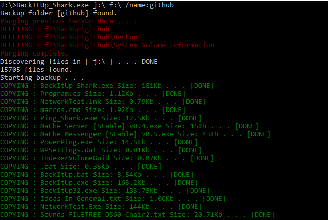
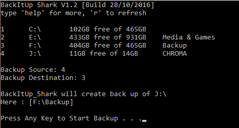
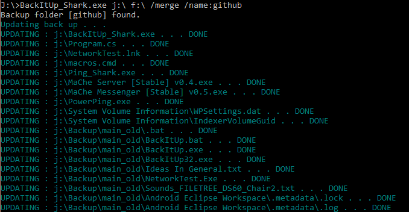

# BackItUp_Shark

  

Memory stick and drive backup tool written in C#

***

# Download

You can download the most recent stable release here: [[Github]](https://github.com/Killeroo/BackItUp_Shark/releases)

# Usage:
    BackItUp_Shark.exe /? | [source] [destination] /silent /merge /name:[name]
    
# Options:
     [source]           Drive (or path) to backup 
     [destination]      Backup location
     
     /?                 Displays help message
     /silent            Run with no output
     /merge             Merge with an existing backup
     /name:[name]       Specifies name for backup folder

# Example:
     BackItUp_Shark G:\ C:\                                -  Backup drive G: to drive C:
     BackItUp_Shark Z:\ C:\ /name:Meow                     -  Backup drive Z: to drive C: in folder named 'Meow                           
     BackItUp_Shark C:\ D:\ /quiet /name:Meow              -  Backup drive Z: to drive C: in folder named 'Meow' with no console output
     BackItUp_Shark C:\mystuff G:\ /merge /name:my_backup  -  Backup "C:\mystuff" to g:\ and if there is an backup called my_backup merge with existing backup
                                               
# Screenshots:

# Note: 
     Running with no arguments will produce a simple menu
     
Written by Matthew Carney [matthewcarney64@gmail.com] =^-^=
